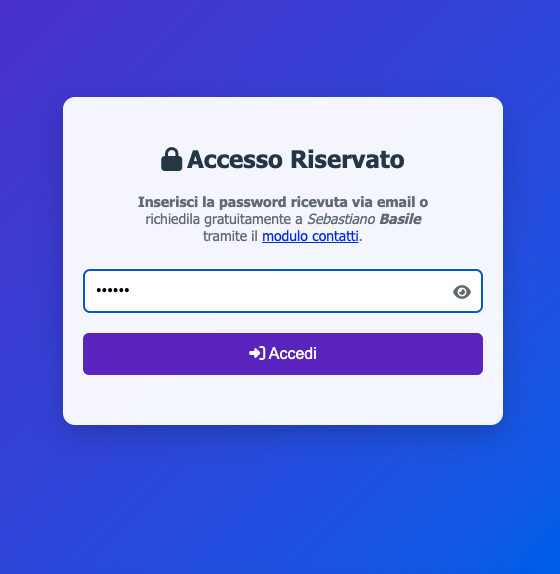
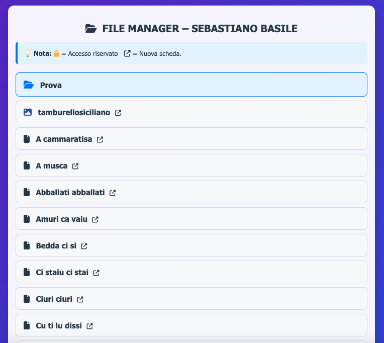
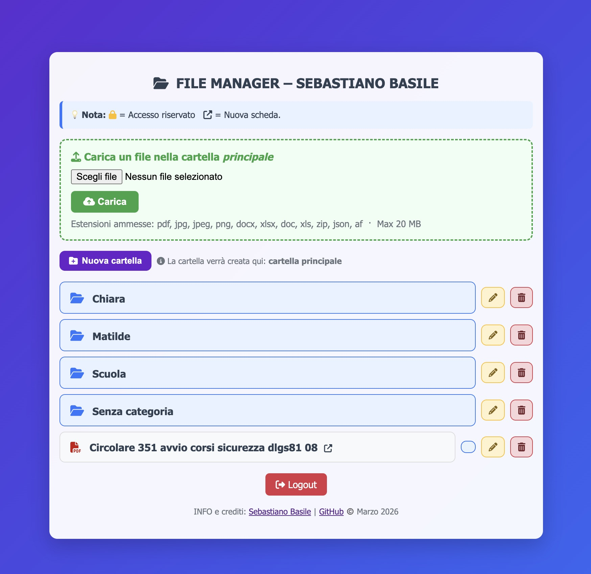

# 📁 PHP File Manager — File Unico

> Navigatore di file e cartelle per server PHP, completamente autonomo in un unico file.  
> Ideale per pubblicare documenti su siti scolastici o intranet.


---

## 📸 Screenshot

| Schermata di login | Interfaccia principale | Azioni File e Cartelle |
|:---:|:---:|:---:|
|  |  |  |

---

## ✨ Caratteristiche

- **File unico** — tutto il necessario è in `index.php`, nessun file esterno richiesto
- **Navigazione ricorsiva** di cartelle e sottocartelle
- **Protezione password** opzionale (attivabile/disattivabile in un'unica riga)
- **Apertura file inline o download** configurabile per tipo di estensione
- **📤 Upload** nella cartella corrente o direttamente nella root, con controllo su dimensione ed estensioni
- **📁 Gestione cartelle completa** — crea, rinomina ed elimina cartelle direttamente dall'interfaccia
- **🖱️ Drag-and-drop** — sposta i file tra le cartelle con un semplice trascinamento
- **File e cartelle nascosti** definibili con semplici array
- **File riservati** segnalati con icona 🔒 tramite prefisso nel nome
- **Apertura in nuova scheda** controllabile globalmente o per singolo file
- **Pagine di errore personalizzate** — 403 e 404 servite dalla cartella `/errore/`
- **Interfaccia responsive** compatibile con desktop e mobile
- **Nessun database** — lavora direttamente sul filesystem

---

## 🚀 Installazione

1. Scarica `index.php` e `.htaccess`
2. Caricali **entrambi** nella stessa cartella del server che vuoi esporre
3. (Facoltativo) Carica le pagine `403.html` e `404.html` nella sottocartella `/errore/`
4. Apri il browser e visita quella cartella

> ⚠️ **Importante:** caricare sempre `.htaccess` insieme a `index.php`. Senza di esso, i file nella cartella sono accessibili direttamente tramite URL anche senza password.

Nessuna dipendenza da installare. Nessuna configurazione del database.

---

## ⚙️ Configurazione

Tutta la configurazione si trova **nelle prime righe di `index.php`**, nel blocco `CONFIGURAZIONE`.

```php
// ── 🔐 ACCESSO ──────────────────────────────────────────────────
$LOGIN_REQUIRED = false;       // true = richiede password | false = accesso libero
$PASSWORD       = "la_tua_password";

// ── 🪟 APERTURA FILE ─────────────────────────────────────────────
$OPEN_IN_NEW_TAB = true;       // true = nuova scheda | false = stessa finestra

// ── 📁 FILE E CARTELLE NASCOSTI ──────────────────────────────────
$EXCLUDED_FILES   = ['index.php', '.htaccess'];
$EXCLUDED_FOLDERS = ['NomeCartellaNascosta'];

// ── 📄 ESTENSIONI AMMESSE ────────────────────────────────────────
$ALLOWED_EXTENSIONS  = ['pdf', 'jpg', 'docx', 'xlsx', 'html'];
$INLINE_EXTENSIONS   = ['pdf', 'html', 'jpg', 'jpeg', 'png'];
$DOWNLOAD_EXTENSIONS = ['docx', 'xlsx', 'doc', 'xls'];

// ── 📤 UPLOAD ────────────────────────────────────────────────────
$UPLOAD_ENABLED    = true;
$UPLOAD_MAX_SIZE   = 10;       // dimensione massima in MB
$UPLOAD_EXTENSIONS = ['pdf', 'jpg', 'docx', 'xlsx'];
```

### Opzioni principali

| Parametro | Valori | Descrizione |
|---|---|---|
| `$LOGIN_REQUIRED` | `true` / `false` | Attiva o disattiva la schermata di login |
| `$PASSWORD` | testo | Password di accesso in chiaro |
| `$OPEN_IN_NEW_TAB` | `true` / `false` | Apertura globale in nuova scheda |
| `$EXCLUDED_FILES` | array | File da non mostrare nella lista |
| `$EXCLUDED_FOLDERS` | array | Cartelle da non mostrare |
| `$ALLOWED_EXTENSIONS` | array | Estensioni visibili e scaricabili |
| `$INLINE_EXTENSIONS` | array | Estensioni aperte nel browser |
| `$DOWNLOAD_EXTENSIONS` | array | Estensioni scaricate direttamente |
| `$UPLOAD_ENABLED` | `true` / `false` | Attiva o disattiva la funzione di upload |
| `$UPLOAD_MAX_SIZE` | numero intero | Dimensione massima file in MB |
| `$UPLOAD_EXTENSIONS` | array | Estensioni accettate in upload |

---

## 🏷️ Convenzioni sui nomi dei file

| Convenzione | Effetto |
|---|---|
| Nome con prefisso `RISERVATO_` | Mostra icona 🔒 (accesso visivamente riservato) |
| Nome con prefisso `PRIV_` | Stessa cosa (alias alternativo) |
| Nome con suffisso `_NUOVO` | Forza apertura in nuova scheda (ignora impostazione globale) |

I prefissi vengono rimossi dal nome visualizzato all'utente.

---

## 🖱️ Drag-and-drop

I file possono essere **spostati tra cartelle** con un semplice trascinamento:

1. Trascina un file sopra il nome di una cartella
2. La cartella si evidenzia come destinazione
3. Rilascia per spostare il file

> ℹ️ La funzione è disponibile solo per gli utenti autenticati (o quando il login è disabilitato). Il trascinamento funziona correttamente anche su file che contengono link interni.

---

## 📁 Gestione cartelle

Dall'interfaccia è possibile, senza uscire dal browser:

| Azione | Descrizione |
|---|---|
| **Nuova cartella** | Crea una sottocartella nella directory corrente |
| **Rinomina** | Modifica il nome di una cartella esistente |
| **Elimina** | Rimuove una cartella (solo se vuota) |

Tutte le azioni usano una finestra modale condivisa con le azioni sui file, per un'interfaccia coerente.

---

## 🔒 Sicurezza

Il tool adotta **due livelli di protezione** che lavorano insieme:

1. **`.htaccess`** (lato server Apache) — instrada tutte le richieste attraverso `index.php`, bloccando l'accesso diretto a qualsiasi file tramite URL. Anche chi conosce il percorso esatto del file non riesce a scaricarlo senza passare da `index.php`.
2. **`index.php`** (lato PHP) — verifica l'autenticazione prima di servire qualsiasi file tramite il parametro `?file=`. Blocca anche eventuali tentativi di directory traversal.

Ulteriori dettagli:
- Solo le estensioni definite in `$ALLOWED_EXTENSIONS` vengono servite
- La sessione scade dopo **1 ora** di inattività
- I file di sistema (`index.php`, `.htaccess`, ecc.) sono esclusi anche se richiesti via URL

> ⚠️ La password è memorizzata **in chiaro** nel file. Per ambienti ad alta sicurezza si consiglia l'autenticazione a livello di server web.

---

## 🗂️ Pagine di errore personalizzate

Il tool supporta pagine di errore personalizzate per i codici **403** e **404**.  
Basta creare una sottocartella `/errore/` con i file:

```
errore/
├── 403.html
└── 404.html
```

Il file `.htaccess` incluso reindirizza automaticamente gli errori a queste pagine.

---

## 📋 Requisiti

- PHP **7.4** o superiore
- Server Apache con `mod_rewrite` abilitato e `AllowOverride All`
- Estensione `session` abilitata (standard in quasi tutti i server)
- Accesso in lettura (e scrittura, per upload/gestione cartelle) alla directory da servire

---

## 📂 Struttura tipica del progetto

```
public_html/documenti/
├── index.php                   ← gestore principale
├── .htaccess                   ← blocca accesso diretto ai file ⚠️ necessario
├── errore/
│   ├── 403.html                ← pagina errore accesso negato (facoltativa)
│   └── 404.html                ← pagina errore non trovato (facoltativa)
├── Circolare_01.pdf
├── Avvisi/
│   ├── Avviso_febbraio.pdf
│   └── RISERVATO_Verbale.pdf
└── Modulistica/
    └── Modulo_iscrizione.docx
```

---

## 📋 Changelog

### v6.2
- Aggiunta azione **rinomina cartella** con modale condivisa
- Aggiunta azione **elimina cartella** (se vuota)
- Fix bug drag-and-drop: gli elementi `<a>` figli non intercettano più l'evento `dragstart`

### v6.1
- Upload diretto nella **cartella root**
- **Creazione cartelle** dall'interfaccia senza FTP
- **Drag-and-drop** per spostare file tra cartelle
- Pagine di errore personalizzate **403/404** in `/errore/`
- Fix tipo MIME per file `.mid`/`.midi`
- Routing completo tramite `.htaccess` — tutti i percorsi passano per `index.php`

### v6.0
- Prima versione consolidata in file unico (`index.php`)
- Navigazione ricorsiva, protezione password, apertura inline/download

---

## ☕ Supporta il progetto

Se questo strumento ti è utile, puoi offrire un contributo volontario tramite PayPal:

[](https://www.paypal.com/paypalme/superscuola)

Ogni contributo, anche piccolo, aiuta a mantenere e migliorare il progetto. Grazie! 🙏

---

## 📜 Licenza

Distribuito con licenza **MIT** — vedi il file [LICENSE](LICENSE).  
Uso libero, anche in contesto scolastico istituzionale.

---

## 👤 Autore

**Sebastiano Basile**  
[basile.superscuola.com](https://basile.superscuola.com/contatti) · [GitHub](https://github.com/sebastianobasile)
